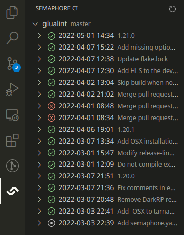
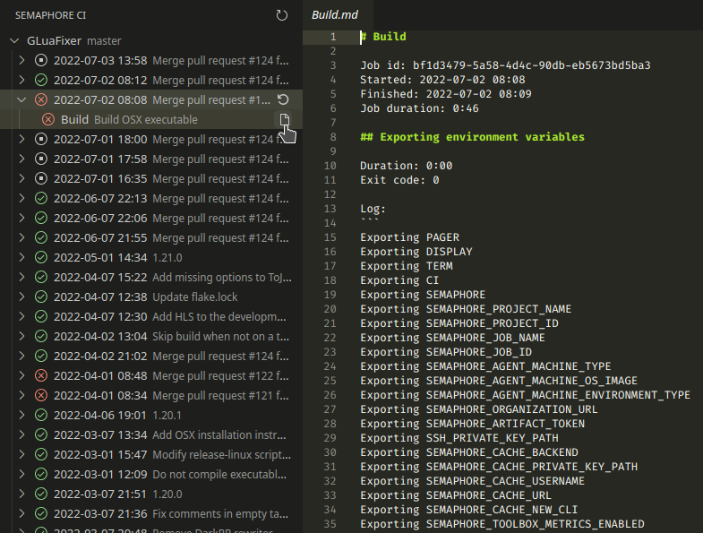
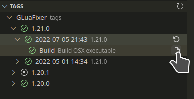

# Semaphore CI (unofficial)

Connect with Semaphore CI and show your build status, right in your editor!

Disclaimer: this extension is not affiliated with [Semaphore CI](https://semaphoreci.com) or the company behind it.

## Features

Show the most recent runs of the current checked out branch, with details showing status of individual blocks and jobs.

Open the logs of a (failed) job and see where it goes wrong!

See and manage tag builds!

Other notable features:

- Automatic refreshing
- Stop a running job
- Re-run Semaphore pipelines

## Extension Settings

This extension contributes the following settings:

- `semaphore-ci.organisations`: The list of organisations that you have access to.
- `semaphore-ci.autorefreshDelay`: The delay between automatic refreshes.

There is also a setting to set the API key, but that will be stored in a file in your home/config directory. This is not stored in the settings because it is unwise to leave an API key in a place that is synchronised to a cloud and other machines.

## Credits

- Semaphore logo taken from [gilbarbara/logos](https://github.com/gilbarbara/logos) ([LICENSE](https://github.com/gilbarbara/logos/blob/40f3135/LICENSE.txt)).
- Some other logos taken and modified from the [vscode/python](https://github.com/microsoft/vscode-python) extension ([LICENSE](https://github.com/microsoft/vscode-python/blob/1187381/LICENSE)).
- Branch logo taken and modified from the [gitkraken/vscode-gitlens](https://github.com/gitkraken/vscode-gitlens/tree/main/images/dark) extension ([LICENSE](https://github.com/gitkraken/vscode-gitlens/blob/main/LICENSE)).

## Release Notes

See [CHANGELOG](./CHANGELOG.md).
